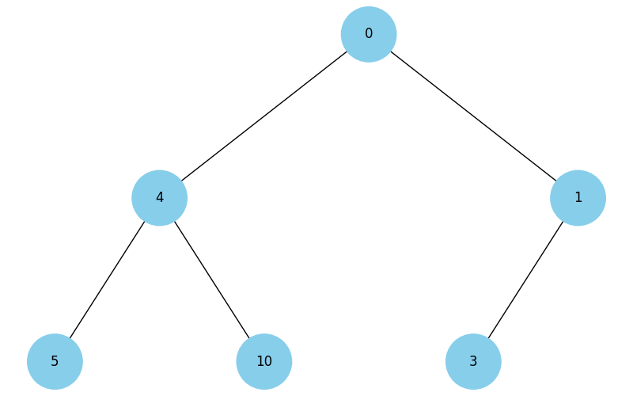

# Final Project

This project comprises several tasks aimed at enhancing your understanding and application of various data structures, algorithms, and visualization techniques in Python. Below are the detailed tasks and their requirements.

## Task 1: Data Structures and Sorting - Working with a Singly Linked List

1. **Reverse a Singly Linked List:**

   - Implement a function that reverses a singly linked list by changing the links between nodes.

2. **Sorting Algorithm for Singly Linked List:**

   - Develop a sorting algorithm for a singly linked list, such as insertion sort or merge sort.

3. **Merge Two Sorted Singly Linked Lists:**
   - Write a function that merges two sorted singly linked lists into one sorted list.

## Task 2: Recursion - Creating a Pythagoras Tree Fractal

Write a Python program that uses recursion to create a Pythagoras tree fractal. The program should visualize the Pythagoras tree fractal, allowing the user to specify the recursion level.


## Task 3: Trees - Dijkstra's Algorithm

Develop Dijkstra's algorithm for finding the shortest paths in a weighted graph using a binary heap. This task includes creating the graph, using the heap to optimize vertex selection, and calculating the shortest paths from the starting vertex to all other vertices.

## Task 4: Binary Heap Visualization

Use the provided code to build a function to visualize a binary heap. The task involves creating a tree from the heap.

```python
import uuid
import networkx as nx
import matplotlib.pyplot as plt

class Node:
    def __init__(self, key, color="skyblue"):
        self.left = None
        self.right = None
        self.val = key
        self.color = color
        self.id = str(uuid.uuid4())

def add_edges(graph, node, pos, x=0, y=0, layer=1):
    if node is not None:
        graph.add_node(node.id, color=node.color, label=node.val)
        if node.left:
            graph.add_edge(node.id, node.left.id)
            l = x - 1 / 2 ** layer
            pos[node.left.id] = (l, y - 1)
            l = add_edges(graph, node.left, pos, x=l, y=y - 1, layer=layer + 1)
        if node.right:
            graph.add_edge(node.id, node.right.id)
            r = x + 1 / 2 ** layer
            pos[node.right.id] = (r, y - 1)
            r = add_edges(graph, node.right, pos, x=r, y=y - 1, layer=layer + 1)
    return graph

def draw_tree(tree_root):
    tree = nx.DiGraph()
    pos = {tree_root.id: (0, 0)}
    tree = add_edges(tree, tree_root, pos)

    colors = [node[1]['color'] for node in tree.nodes(data=True)]
    labels = {node[0]: node[1]['label'] for node in tree.nodes(data=True)}

    plt.figure(figsize=(8, 5))
    nx.draw(tree, pos=pos, labels=labels, arrows=False, node_size=2500, node_color=colors)
    plt.show()

root = Node(0)
root.left = Node(4)
root.left.left = Node(5)
root.left.right = Node(10)
root.right = Node(1)
root.right.left = Node(3)
draw_tree(root)
```



## Task 5: Visualization of Binary Tree Traversal

Using the code from Task 4, create a Python program that visualizes tree traversals (both depth-first and breadth-first). The program should display each step with nodes in different colors, using the 16-system RGB (e.g., #1296F0). Node colors should change from dark to light shades based on the traversal sequence, with each node receiving a unique color reflecting the order of traversal. Use a stack and a queue, NOT recursion.

## Task 6: Greedy Algorithms and Dynamic Programming

Write a Python program that uses both a greedy algorithm and dynamic programming to solve the problem of selecting food with the highest total calorie content within a limited budget. Each food item has a specified cost and calorie content, represented in a dictionary where the key is the name of the dish, and the value is a dictionary with cost and calorie content.

```python
items = {
    "pizza": {"cost": 50, "calories": 300},
    "hamburger": {"cost": 40, "calories": 250},
    "hot-dog": {"cost": 30, "calories": 200},
    "pepsi": {"cost": 10, "calories": 100},
    "cola": {"cost": 15, "calories": 220},
    "potato": {"cost": 25, "calories": 350}
}
```

1. **Greedy Algorithm:**

   - Develop the function `greedy_algorithm` to select dishes by maximizing the calorie-to-cost ratio without exceeding the given budget.

2. **Dynamic Programming:**
   - Create the function `dynamic_programming` to compute the optimal set of dishes to maximize calorie intake within the given budget.

## Task 7: Monte Carlo Method

Write a Python program that simulates a large number of dice rolls, calculates the sums of the numbers on the dice, and determines the probability of each possible sum. Simulate the rolling of two dice many times. For each roll, determine the sum of the numbers on both dice and count how often each possible sum (from 2 to 12) appears during the simulation. Calculate the probability of each sum based on the simulation data. Create a table or graph displaying the probabilities of each sum as determined by the Monte Carlo method. Compare the Monte Carlo results with the analytical probabilities shown in the table.


