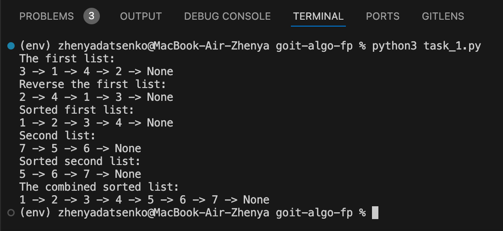

# Final Project

This project comprises several tasks aimed at enhancing your understanding and application of various data structures, algorithms, and visualization techniques in Python. Below are the detailed tasks and their requirements.

## Task 1: Data Structures and Sorting - Working with a Singly Linked List

1. **Reverse a Singly Linked List:**

   - Implement a function that reverses a singly linked list by changing the links between nodes.

2. **Sorting Algorithm for Singly Linked List:**

   - Develop a sorting algorithm for a singly linked list, such as insertion sort or merge sort.

3. **Merge Two Sorted Singly Linked Lists:**
   - Write a function that merges two sorted singly linked lists into one sorted list.

## Task 2: Recursion - Creating a Pythagoras Tree Fractal

Write a Python program that uses recursion to create a Pythagoras tree fractal. The program should visualize the Pythagoras tree fractal, allowing the user to specify the recursion level.


## Task 3: Trees - Dijkstra's Algorithm

Develop Dijkstra's algorithm for finding the shortest paths in a weighted graph using a binary heap. This task includes creating the graph, using the heap to optimize vertex selection, and calculating the shortest paths from the starting vertex to all other vertices.

## Task 4: Binary Heap Visualization

Use the provided code to build a function to visualize a binary heap. The task involves creating a tree from the heap.

```python
import uuid
import networkx as nx
import matplotlib.pyplot as plt

class Node:
    def __init__(self, key, color="skyblue"):
        self.left = None
        self.right = None
        self.val = key
        self.color = color
        self.id = str(uuid.uuid4())

def add_edges(graph, node, pos, x=0, y=0, layer=1):
    if node is not None:
        graph.add_node(node.id, color=node.color, label=node.val)
        if node.left:
            graph.add_edge(node.id, node.left.id)
            l = x - 1 / 2 ** layer
            pos[node.left.id] = (l, y - 1)
            l = add_edges(graph, node.left, pos, x=l, y=y - 1, layer=layer + 1)
        if node.right:
            graph.add_edge(node.id, node.right.id)
            r = x + 1 / 2 ** layer
            pos[node.right.id] = (r, y - 1)
            r = add_edges(graph, node.right, pos, x=r, y=y - 1, layer=layer + 1)
    return graph

def draw_tree(tree_root):
    tree = nx.DiGraph()
    pos = {tree_root.id: (0, 0)}
    tree = add_edges(tree, tree_root, pos)

    colors = [node[1]['color'] for node in tree.nodes(data=True)]
    labels = {node[0]: node[1]['label'] for node in tree.nodes(data=True)}

    plt.figure(figsize=(8, 5))
    nx.draw(tree, pos=pos, labels=labels, arrows=False, node_size=2500, node_color=colors)
    plt.show()

root = Node(0)
root.left = Node(4)
root.left.left = Node(5)
root.left.right = Node(10)
root.right = Node(1)
root.right.left = Node(3)
draw_tree(root)
```


## Task 5: Visualization of Binary Tree Traversal

Using the code from Task 4, create a Python program that visualizes tree traversals (both depth-first and breadth-first). The program should display each step with nodes in different colors, using the 16-system RGB (e.g., #1296F0). Node colors should change from dark to light shades based on the traversal sequence, with each node receiving a unique color reflecting the order of traversal. Use a stack and a queue, NOT recursion.

## Task 6: Greedy Algorithms and Dynamic Programming

Write a Python program that uses both a greedy algorithm and dynamic programming to solve the problem of selecting food with the highest total calorie content within a limited budget. Each food item has a specified cost and calorie content, represented in a dictionary where the key is the name of the dish, and the value is a dictionary with cost and calorie content.

```python
items = {
    "pizza": {"cost": 50, "calories": 300},
    "hamburger": {"cost": 40, "calories": 250},
    "hot-dog": {"cost": 30, "calories": 200},
    "pepsi": {"cost": 10, "calories": 100},
    "cola": {"cost": 15, "calories": 220},
    "potato": {"cost": 25, "calories": 350}
}
```

1. **Greedy Algorithm:**

   - Develop the function `greedy_algorithm` to select dishes by maximizing the calorie-to-cost ratio without exceeding the given budget.

2. **Dynamic Programming:**
   - Create the function `dynamic_programming` to compute the optimal set of dishes to maximize calorie intake within the given budget.

## Task 7: Monte Carlo Method

Write a Python program that simulates a large number of dice rolls, calculates the sums of the numbers on the dice, and determines the probability of each possible sum. Simulate the rolling of two dice many times. For each roll, determine the sum of the numbers on both dice and count how often each possible sum (from 2 to 12) appears during the simulation. Calculate the probability of each sum based on the simulation data. Create a table or graph displaying the probabilities of each sum as determined by the Monte Carlo method. Compare the Monte Carlo results with the analytical probabilities shown in the table.


# Results and Conclusions

## Task 1: Data Structures and Sorting - Working with a Singly Linked List



1. **Reversing a Singly Linked List:**

   - The function `reverse_linked_list` successfully reversed the first list by changing the links between nodes. The original order of elements was reversed, as shown in the output.

2. **Sorting a Singly Linked List:**

   - The function `insertion_sort_linked_list` sorted both the reversed first list and the second list correctly. Insertion sort was used to reorder the elements, demonstrating the ability to handle unsorted input efficiently.

3. **Merging Two Sorted Singly Linked Lists:**

   - The function `merge_sorted_linked_lists` combined the two sorted lists into a single sorted list, maintaining the order of elements. This confirmed the correct implementation of merging sorted linked lists.

## Task 2: Recursion - Creating a Pythagoras Tree Fractal


1. **Recursive Function:**

   - The `draw_pythagoras_tree` function uses recursion to draw the fractal tree. It takes a turtle object (`t`), the length of the current branch (`branch_length`), and the current recursion level (`level`) as parameters. The function draws the current branch and recursively draws the two child branches at a reduced length and depth.

2. **Base Case:**

   - The base case for the recursion is when `level` equals zero. At this point, the function returns without drawing any further branches, effectively ending the recursion.

3. **Branching Angles:**

   - The angles for the branches are set to create a realistic and visually appealing fractal tree. Specifically, the turtle turns right by 30 degrees for the right branch and left by 60 degrees (compensating the right turn) for the left branch before returning to the initial position.

4. **User Interaction:**

   - The program prompts the user to enter the desired level of recursion. This flexibility allows users to generate fractal trees of varying complexity by simply changing the input value.

5. **Visualization:**
   - The program uses the Turtle graphics module to draw the fractal tree on the screen. The turtle starts at a specified position and orientation, ensuring the tree is centered and appropriately positioned.

## Task 3: Trees - Dijkstra's Algorithm


1. **Graph Representation:**

   - The `Graph` class uses a dictionary to represent the graph, where each vertex points to another dictionary of its neighboring vertices and corresponding edge weights. This adjacency list representation is efficient for sparse graphs.

2. **Dijkstra's Algorithm Implementation:**

   - The `dijkstra` method initializes a dictionary `distances` to store the shortest distance from the start vertex to every other vertex, initially set to infinity. The distance to the start vertex itself is set to zero.
   - A priority queue (binary heap) is used to keep track of vertices to explore, prioritizing the vertex with the smallest known distance.

3. **Priority Queue Optimization:**

   - The use of `heapq` ensures that each vertex is processed in order of increasing distance, which optimizes the selection process. This reduces the time complexity compared to a linear search for the next vertex to process.

4. **Relaxation Process:**

   - For each vertex, the algorithm updates the shortest known distances to its neighbors if a shorter path is found through the current vertex. These updates are done using the relaxation technique, and the priority queue is updated accordingly.

5. **Efficiency:**

   - The implementation leverages the binary heap for efficient extraction of the minimum distance vertex and insertion of updated distances, achieving a time complexity of \(O(E \log V)\), where \(E\) is the number of edges and \(V\) is the number of vertices.

6. **Example Usage:**
   - The provided example demonstrates the algorithm on a simple graph with vertices 'A', 'B', 'C', and 'D'. The calculated shortest distances from vertex 'A' to all other vertices are printed, showing the effectiveness of the algorithm.

## Task 4: Binary Heap Visualization


1. **Tree Representation of the Heap:**

   - The `build_heap_tree` function constructs a binary tree from the heap. It creates `Node` objects for each element in the heap and arranges them into a binary tree structure where each node's left and right children are determined based on the heap's array representation.

2. **Visualization:**

   - The `draw_tree` function visualizes the binary tree using the `networkx` and `matplotlib` libraries. Nodes are assigned unique IDs and positioned based on their level in the tree. The tree is displayed with nodes labeled by their values and colored according to the specified node color.

3. **Example Usage:**

   - An example array `[10, 5, 3, 2, 1]` is used to demonstrate the functionality. The array is heapified, converted into a binary tree, and then visualized. The resulting visualization accurately represents the binary heap structure.

4. **Correctness of Program Execution:**

- **Heap Property Maintenance:** The `heapify` function correctly maintains the heap property by using the `heapq.heappush` method, ensuring that each parent node is less than or equal to its child nodes. This is evident from the constructed heap, where the smallest element is always at the root.
- **Tree Construction Accuracy:** The `build_heap_tree` function accurately constructs the binary tree from the heap. The tree nodes are correctly assigned left and right children based on their positions in the heap array, maintaining the hierarchical structure.
- **Visualization Accuracy:** The `draw_tree` function accurately visualizes the binary tree. Each node is placed correctly according to its position in the tree, and the labels and colors are correctly assigned, allowing for a clear and accurate visual representation of the heap.

## Task 5: Visualization of Binary Tree Traversal


1. **Visualization Functionality:**

   - `draw_tree` function visualizes the binary tree using `networkx` and `matplotlib`.
   - Nodes are positioned based on their level and colored according to traversal order.

2. **Breadth-First Search (BFS):**

   - `bfs` function uses a queue to traverse the tree level by level.
   - Nodes are visited in the order they appear at each level, starting from the root.

3. **Depth-First Search (DFS):**

   - `dfs` function uses a stack to traverse the tree depth-first.
   - Nodes are visited by exploring as far as possible along each branch before backtracking.

4. **Color Assignment:**
   - `assign_colors` function assigns colors to nodes based on traversal order.
   - Colors range from dark to light shades, calculated using RGB values.

### Comparison of BFS and DFS Visualizations

1. **Traversal Pattern:**

   - BFS: Nodes visited level by level, highlighting tree breadth at each level.
   - DFS: Nodes visited by depth, highlighting depth-first exploration before backtracking.

2. **Color Gradation:**

   - Both BFS and DFS visualizations use color gradation to represent traversal order.
   - BFS: Gradual color changes across levels.
   - DFS: Color changes along branches, showing depth-first exploration.

3. **Node Order:**
   - BFS and DFS result in different node visitation orders.
   - BFS: All nodes at each level visited before moving to the next level.
   - DFS: Each branch fully explored before moving to the next branch.

## Task 6: Greedy Algorithms and Dynamic Programming


1. **Greedy Algorithm:**

   - **Approach:** Selects items based on the highest calories-to-cost ratio.
   - **Process:**
     - Items are sorted by their calories-to-cost ratio in descending order.
     - Iteratively adds items to the selection as long as the budget is not exceeded.
   - **Performance:**
     - Fast and straightforward, but might not always produce the optimal solution.
     - Example result with a budget of 100: selected items are ['potato', 'hamburger', 'cola', 'pepsi'] with total calories of 920.

2. **Dynamic Programming:**

   - **Approach:** Finds the optimal combination of items to maximize total calories within the budget.
   - **Process:**
     - Uses a 2D table `dp` where `dp[i][j]` represents the maximum calories achievable with the first `i` items and budget `j`.
     - Fills the table by considering each item and deciding whether to include it or not.
     - Backtracks through the table to determine the selected items.
   - **Performance:**
     - Guarantees the optimal solution but requires more computational resources.
     - Example result with a budget of 100: selected items are ['potato', 'hot-dog', 'cola', 'pepsi'] with total calories of 870.

3. **Comparison:**

   - **Greedy Algorithm:**
     - Pros: Simple and quick to implement.
     - Cons: May not always produce the optimal result.
   - **Dynamic Programming:**
     - Pros: Ensures the optimal solution.
     - Cons: More complex and computationally intensive.

4. **Conclusion:**
   - Both approaches have their merits. The Greedy Algorithm is useful for quick approximations, while Dynamic Programming is essential for finding the exact optimal solution.
   - Depending on the specific requirements and constraints (e.g., computational resources, time), one can choose the appropriate algorithm to use.

## Task 7: Monte Carlo Method

### Comparison of Dice Rolling Probabilities

The table below presents the probabilities for each sum obtained through the Monte Carlo method, alongside the analytical probabilities. Deviations between the calculated probabilities are also indicated.

| Sum | Probability (Monte Carlo Method) | Probability (Analytical) | Deviation (%) |
| --- | -------------------------------- | ------------------------ | ------------- |
| 2   | 2.79%                            | 2.78%                    | +0.01%        |
| 3   | 5.44%                            | 5.56%                    | -0.12%        |
| 4   | 8.95%                            | 8.33%                    | +0.62%        |
| 5   | 11.86%                           | 11.11%                   | +0.75%        |
| 6   | 13.94%                           | 13.89%                   | +0.05%        |
| 7   | 16.29%                           | 16.67%                   | -0.38%        |
| 8   | 13.38%                           | 13.89%                   | -0.51%        |
| 9   | 10.61%                           | 11.11%                   | -0.50%        |
| 10  | 8.17%                            | 8.33%                    | -0.16%        |
| 11  | 5.66%                            | 5.56%                    | +0.10%        |
| 12  | 2.91%                            | 2.78%                    | +0.13%        |

### Analysis of Results

**Accuracy of Monte Carlo Method:**

- The deviation between the probabilities obtained using the Monte Carlo method and the analytical probabilities is minimal. The deviations range from -0.50% to +0.75%, indicating the accuracy of the Monte Carlo method with a large number of simulations.

**Consistency:**

- Monte Carlo method results generally align with the analytical calculations, with minor deviations. This confirms the correctness of the simulations and indicates that the simulations were sufficiently large to approximate the analytical results closely.

**Nature of Deviations:**

- Minor deviations may be due to the random nature of simulations and are a normal part of using the Monte Carlo method. More simulations could reduce these deviations, but from a practical standpoint, the results are already quite close to the analytical values.

### Conclusion

The results obtained through the Monte Carlo method are very close to the analytical values, confirming the effectiveness and accuracy of simulations with a sufficiently large number of iterations. This demonstrates that the Monte Carlo method can be a reliable tool for estimating probabilities in random processes, such as dice rolls.


